# Grammar

> Note for new readers:
> This chapter is included mainly to give a complete structural view of the
> language. You do not need to read the full grammar to start using or
> understanding NEX. If the notation feels unfamiliar, it is perfectly fine to
> skim this page and return to it later as a reference.

This chapter gives a compact view of the current NEX surface grammar. It is
meant as a structural summary for readers who want to see how the language fits
together after reading the surrounding reference chapters.

Like most practical parsers, NEX also has a few rules that are checked outside
the grammar itself. For example, `return` is only valid inside a function body,
and nested function declarations are rejected even though both are statement
forms in the general grammar.

## Surface grammar

```text
<program>           ::= <statement>* EOF

<statement>         ::= <typed-decl>
                      | <function-decl>
                      | <return-stmt>
                      | <if-stmt>
                      | <while-stmt>
                      | <for-stmt>
                      | <assignment-stmt>
                      | <expr-stmt>

<typed-decl>        ::= <typed-decl-core> ";"

<typed-decl-core>   ::= <scalar-typed-decl-core>
                      | <array-decl-core>

<scalar-typed-decl-core> ::= <scalar-type> <identifier> "=" <expression>

<array-decl-core>   ::= <array-type> <identifier>

<type>              ::= <scalar-type> | <array-type>

<scalar-type>       ::= "int" | "str" | "bool"

<array-type>        ::= "array" "<" ( "int" | "str" ) ">"

<function-decl>     ::= "fn" <identifier> "(" [ <parameters> ] ")" "->" <return-type> <block>

<parameters>        ::= <parameter> ("," <parameter>)*

<parameter>         ::= <type> <identifier>

<return-type>       ::= <type> | "void"

<return-stmt>       ::= "return" [ <expression> ] ";"

<if-stmt>           ::= "if" "(" <expression> ")" <block> [ "else" <block> ]

<while-stmt>        ::= "while" "(" <expression> ")" <block>

<for-stmt>          ::= "for" "(" <for-init> ";" <expression> ";" <for-iter> ")" <block>

<for-init>          ::= empty
                      | <typed-decl-core>
                      | <assignment-core>
                      | <expression>

<for-iter>          ::= empty
                      | <assignment-core>
                      | <expression>

<block>             ::= "{" <statement>* "}"

<assignment-stmt>   ::= <assignment-core> ";"

<assignment-core>   ::= <assignment-target> "=" <expression>

<assignment-target> ::= <identifier> | <index-expr>

<expr-stmt>         ::= <expression> ";"

<expression>        ::= <logical-or>

<logical-or>        ::= <logical-and> ( "||" <logical-and> )*

<logical-and>       ::= <comparison> ( "&&" <comparison> )*

<comparison>        ::= <term> (( "<" | ">" | "<=" | ">=" | "==" | "!=" ) <term>)*

<term>              ::= <factor> (("+" | "-") <factor>)*

<factor>            ::= <unary> (("*" | "/" | "%") <unary>)*

<unary>             ::= ("-" | "!") <unary>
                      | <postfix>

<postfix>           ::= <primary> ( <call-suffix> | <index-suffix> | <method-suffix> | <postfix-update> )*

<call-suffix>       ::= "(" [ <arguments> ] ")"

<index-suffix>      ::= "[" <expression> "]"

<method-suffix>     ::= "." <identifier> "(" [ <arguments> ] ")"

<postfix-update>    ::= "++" | "--"

<index-expr>        ::= <postfix> <index-suffix>

<primary>           ::= <number>
                      | <string>
                      | "true"
                      | "false"
                      | <identifier>
                      | "(" <expression> ")"

<arguments>         ::= <expression> ("," <expression>)*
```

<!-- GENERATED GRAMMAR DIAGRAMS START -->

## Syntax diagrams

### `<program>`

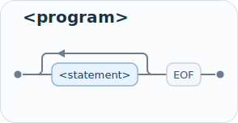

### `<statement>`

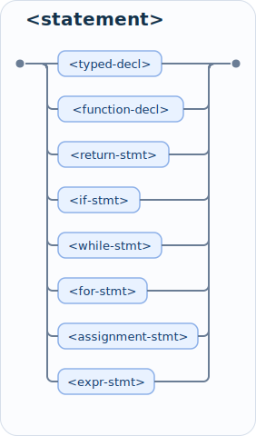

### `<typed-decl>`

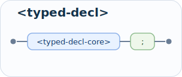

### `<typed-decl-core>`

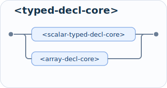

### `<scalar-typed-decl-core>`

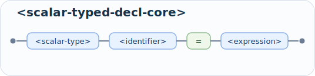

### `<array-decl-core>`

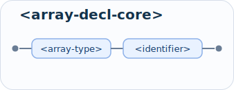

### `<type>`

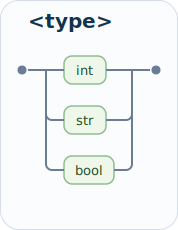

### `<scalar-type>`

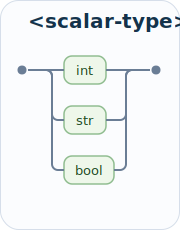

### `<array-type>`

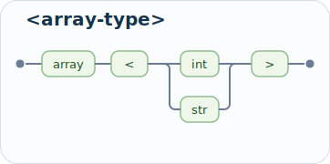

### `<function-decl>`

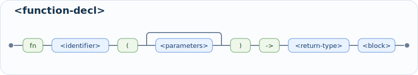

### `<parameters>`

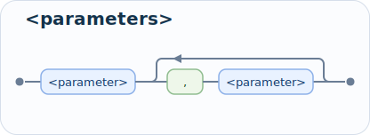

### `<parameter>`

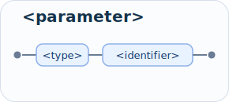

### `<return-type>`

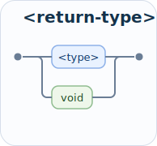

### `<return-stmt>`

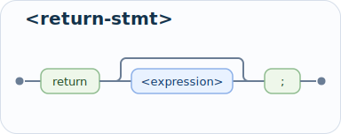

### `<if-stmt>`

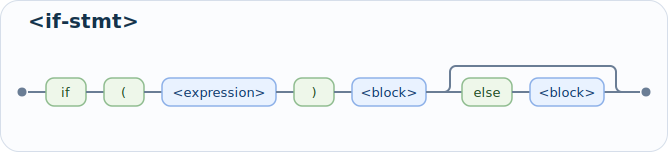

### `<while-stmt>`

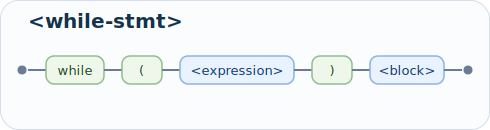

### `<for-stmt>`

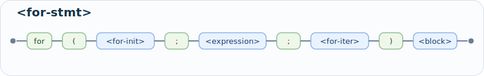

### `<for-init>`

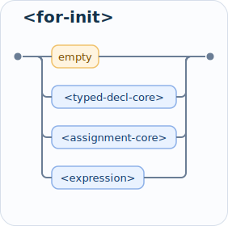

### `<for-iter>`

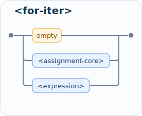

### `<block>`

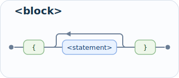

### `<assignment-stmt>`

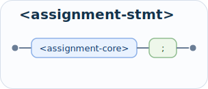

### `<assignment-core>`

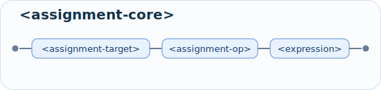

### `<assignment-target>`

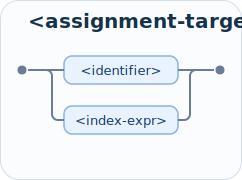

### `<expr-stmt>`

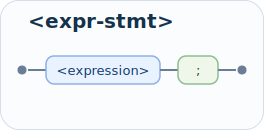

### `<expression>`

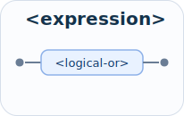

### `<logical-or>`

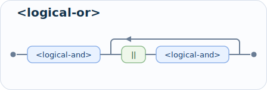

### `<logical-and>`

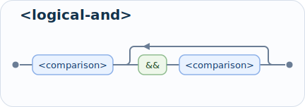

### `<comparison>`

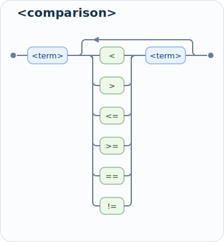

### `<term>`

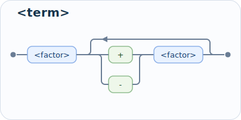

### `<factor>`

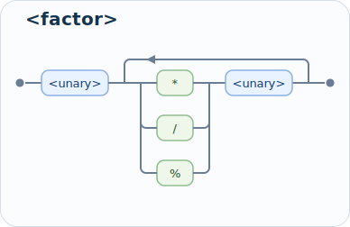

### `<unary>`

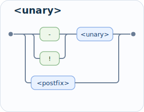

### `<postfix>`

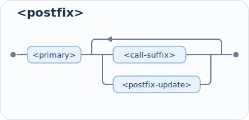

### `<call-suffix>`

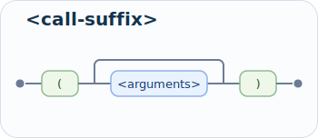

### `<index-suffix>`

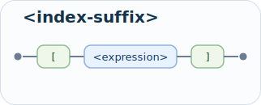

### `<method-suffix>`

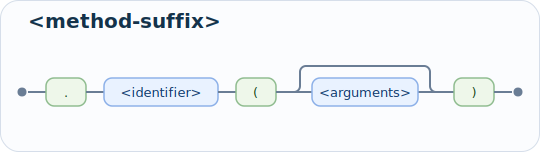

### `<postfix-update>`

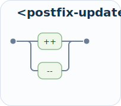

### `<index-expr>`

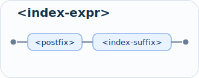

### `<primary>`

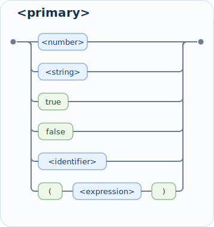

### `<arguments>`

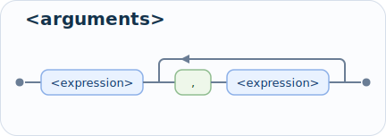

<!-- GENERATED GRAMMAR DIAGRAMS END -->

## Notes

- Function calls are postfix expressions, not statements in their own right.
  That is why built-in functions such as `print(...)` and `input()` can appear
  in an initializer, inside another call, or as a plain expression statement.
- Array declarations are syntactically distinct from scalar declarations:
  `array<int> arr;` is valid, while array declarations with initializers are
  currently rejected.
- Postfix `++` and `--` are also part of the expression grammar. In the current
  implementation they are restricted to variable operands.
- Postfix expressions now also include array indexing such as `arr[-1]` and
  method-style calls such as `arr.length()`, `arr.resize(3)`, or `arr.reset()`.
- `for` reuses declaration, assignment, and expression forms in its header, but
  without extra trailing semicolons inside those clauses.
- The grammar allows repeated comparison operators syntactically. Runtime type
  rules still determine whether a particular chained comparison is meaningful.
- Logical operators are part of the expression grammar, with `&&` binding more
  tightly than `||`.

For the meaning of each construct, the surrounding reference chapters remain
the authoritative explanation. This chapter is mainly a compact syntax map.
